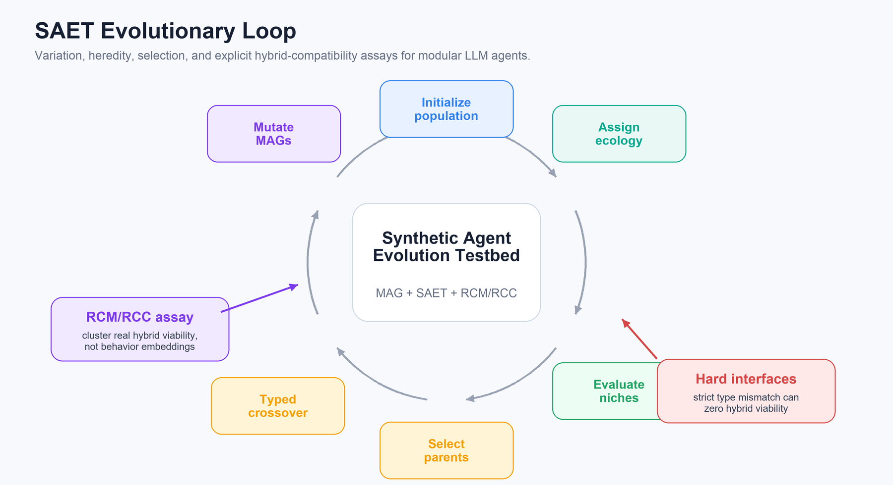
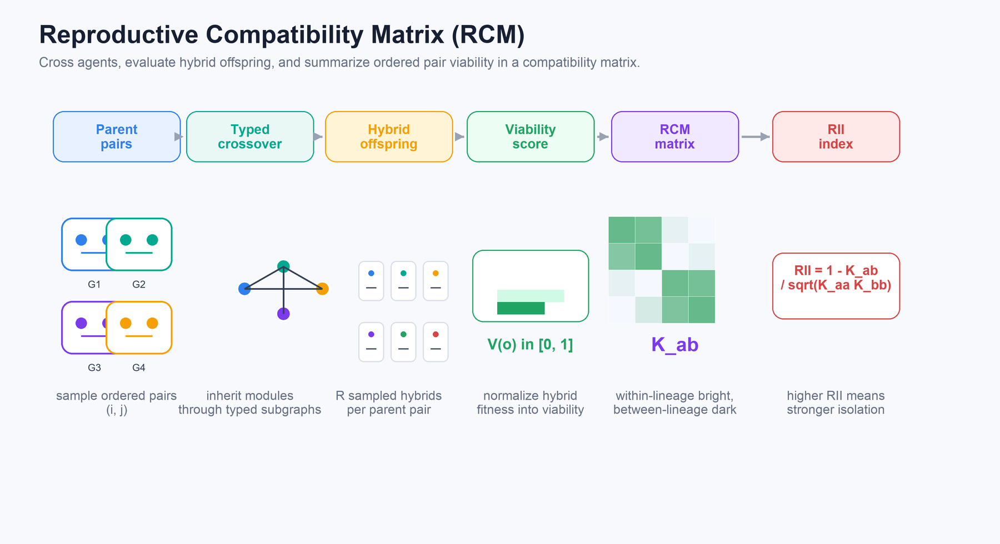
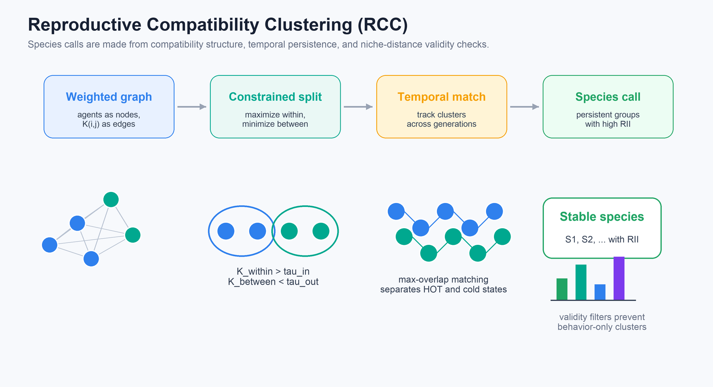

<div align="center">

# Agent Species

**Detectable Reproductive Isolation in LLM Agent Populations Requires Hard Interface Incompatibility**

Anonymous Authors

<p>
  <a href="LICENSE"></a>
  <a href="requirements.txt"></a>
</p>

</div>

This repository contains the code release for **Detectable Reproductive Isolation in LLM Agent Populations Requires Hard Interface Incompatibility**. The project asks whether evolving modular LLM-agent populations form species-like reproductive boundaries, measured by the viability of real hybrid offspring rather than by behavior clusters alone.

The headline result is cautious and mechanistic: ecological specialization can appear without reproductive isolation. Detectable agent "species" emerge only when hard interface incompatibilities make cross-lineage hybrids low-viability.

## Key Findings

- **Synthetic EST validation.** Epistatic load predicts hybrid fitness loss with `R^2 = 0.989`, and the critical-complexity scaling law tracks empirical thresholds with `r = 0.985`.
- **Positive control succeeds.** Hand-seeded rigid interface incompatibility reaches `RII = 1.0` at multiple checkpoints across a 20-generation trajectory.
- **Soft interfaces do not speciate.** Seven spontaneous LLM-agent evolutionary forks end at `K = 1`, `RII = 0`, despite niche-specialized competence.
- **No individual super-agent.** Per-agent multi-niche evaluation finds zero individual super-agents across 480 agent-checkpoints.
- **Fine-grained RCC reveals bistability.** After generation 12, hard-interface mild evolution alternates between HOT and cold spectral states; HOT detections occur in 43% of checkpoints with mean HOT `RII ~= 0.97`.

## Synthetic Agent Evolution Testbed

<p align="center">
  
</p>

SAET evolves populations of **Modular Agent Genomes (MAGs)** across planning, long-context memory, and retrieval-style niches. It supports mutation, typed subgraph crossover, niche evaluation, parent selection, and explicit reproductive-compatibility measurement.

## Reproductive Compatibility Assay

<p align="center">
  
</p>

For ordered parent pairs `(i, j)`, the system samples hybrid offspring through typed crossover, evaluates each hybrid, and aggregates viability into a **Reproductive Compatibility Matrix (RCM)**. The **Reproductive Isolation Index (RII)** compares between-lineage compatibility to within-lineage compatibility.

<p align="center">
  
</p>

**Reproductive Compatibility Clustering (RCC)** turns the RCM into weighted graphs, searches for clusters with high within-cluster and low between-cluster compatibility, tracks clusters through time, and validates species calls with persistence and niche-distance filters.

## Repository Layout

```text
Agent_Darwwin/
|-- assets/                  # README figures redrawn from the paper diagrams
|-- data/                    # Founder genomes
|-- experiments/
|   |-- core/                # MAG, crossover, SAET loop, LLM client, runner
|   |-- niches/              # PlanBench, LoCoMo, HotpotQA evaluators
|   |-- synthetic/           # API-free synthetic validation experiments
|   |-- tests/               # Lightweight smoke tests
|   |-- exp1_cell3.py        # Spontaneous multi-niche baseline
|   |-- exp1_cell3_v17.py    # Hand-seeded controls and ablations
|   |-- m2_anchor1.py        # Founder calibration anchor
|   |-- m2_b0_runner.py      # Founder baseline runner
|   `-- m5_anchor4.py        # Single-niche negative control
|-- paper_analysis/          # Post-hoc analysis and plotting scripts
|-- analysis/                # Legacy analysis scripts retained for compatibility
|-- main.pdf                 # Paper draft
|-- requirements.txt
|-- .env.example
|-- LICENSE
`-- README.md
```

Generated outputs are written to `results/`, `paper/data/`, or local figure folders and are ignored by git.

## Installation

Use Python 3.11 or newer.

```bash
git clone git@github.com:Hik289/Agent_Darwwin.git
cd Agent_Darwwin

python -m venv .venv
source .venv/bin/activate
pip install --upgrade pip
pip install -r requirements.txt
```

The synthetic experiments run locally. The LLM-agent experiments additionally require an OpenAI-compatible Azure endpoint and external benchmark assets.

## API Configuration

Copy the environment template and fill in your credentials:

```bash
cp .env.example .env
```

Then export variables before running LLM experiments:

```bash
set -a
source .env
set +a
```

Required variables:

```bash
AZURE_ENDPOINT=https://YOUR_RESOURCE.openai.azure.com/openai/v1
AZURE_API_KEY=YOUR_AZURE_API_KEY
AZURE_MODEL=gpt-5.4-mini
```

The client reads these variables in [`experiments/core/llm_client.py`](experiments/core/llm_client.py). Using another OpenAI-compatible model should be treated as a new experimental condition.

## External Benchmark Assets

This release includes code, founder genomes, and analysis scripts, but not large external benchmark repositories or raw API result caches. Place external assets under `data/` before running the full LLM experiments:

```text
data/
|-- planbench/plan-bench/
|-- val/build/linux64/Release/bin/Validate
|-- locomo/snap_locomo/data/locomo10.json
`-- ...
```

The API-free synthetic experiments do not require these assets.

## Quick Checks

Run the smoke test:

```bash
python experiments/tests/test_m1_smoke.py
```

Run the synthetic validation experiments:

```bash
python experiments/synthetic/run_exp4_regression.py
python experiments/synthetic/run_exp5_lsweep.py
python experiments/synthetic/run_exp6_dynamics.py
```

These commands write JSON summaries under `results/`.

## Main LLM Experiments

Run commands from the repository root.

### Spontaneous Multi-Niche Baseline

```bash
python experiments/exp1_cell3.py \
  --niches planbench_blocksworld locomo hotpotqa \
  --N 24 --T 30 --eval-every 5 \
  --R-rcm 3 --rcm-eval-tasks 2 --pop-eval-tasks 4 \
  --mu 0.05 --beta 5.0 --m-migration 0.05 \
  --lambda-c 0.1 --tau-in 0.10 --tau-out 0.05 \
  --mismatch-mode soft \
  --founder data/founder_genome_v4_typed.json \
  --out results/spontaneous_baseline.json \
  --progress results/spontaneous_baseline_progress.json
```

### Hand-Seeded Positive Control

This setting imposes strict typed interface boundaries and verifies that RCM/RCC detects reproductive isolation when cross-lineage hybrid viability is mechanically suppressed.

```bash
python experiments/exp1_cell3_v17.py \
  --niches planbench_blocksworld locomo hotpotqa \
  --N 24 --T 30 --eval-every 5 \
  --R-rcm 3 --rcm-eval-tasks 2 --pop-eval-tasks 4 \
  --mu 0.05 --beta 5.0 --m-migration 0.0 \
  --lambda-c 0.1 --tau-in 0.10 --tau-out 0.05 \
  --mismatch-mode rigid --mutate-type-weight 0.0 \
  --hand-seed --seed 50 --budget 50 \
  --founder data/founder_genome_v4_typed.json \
  --out results/positive_control.json \
  --progress results/positive_control_progress.json
```

### Fine-Grained RCC Measurement

Use `--eval-every 1` to measure RCC every generation and reproduce the spectral-bistability analysis.

```bash
python experiments/exp1_cell3_v17.py \
  --niches planbench_blocksworld locomo hotpotqa \
  --N 24 --T 25 --eval-every 1 \
  --R-rcm 3 --rcm-eval-tasks 2 --pop-eval-tasks 4 \
  --mu 0.05 --beta 5.0 --m-migration 0.05 \
  --lambda-c 0.1 --tau-in 0.10 --tau-out 0.05 \
  --mismatch-mode rigid --mutate-type-weight 0.05 \
  --hand-seed --seed 51 --budget 50 \
  --founder data/founder_genome_v4_typed.json \
  --out results/fine_rcc.json \
  --progress results/fine_rcc_progress.json
```

## Paper Analysis

Post-hoc analysis scripts live in [`paper_analysis/`](paper_analysis/). They expect completed result JSON files in `results/` or `paper/data/results_cache/`.

```bash
python paper_analysis/b1_rcc_sensitivity.py
python paper_analysis/b1_plot.py
python paper_analysis/b3_raw_pairwise.py
python paper_analysis/b3_plot_v2.py
python paper_analysis/b2_bistability.py
```

## Citation

```bibtex
@misc{agentspecies2026reproductiveisolation,
  title  = {Detectable Reproductive Isolation in LLM Agent Populations Requires Hard Interface Incompatibility},
  author = {Anonymous Authors},
  year   = {2026},
  note   = {Preprint}
}
```

## License

The code is released under the MIT License. See [`LICENSE`](LICENSE).
